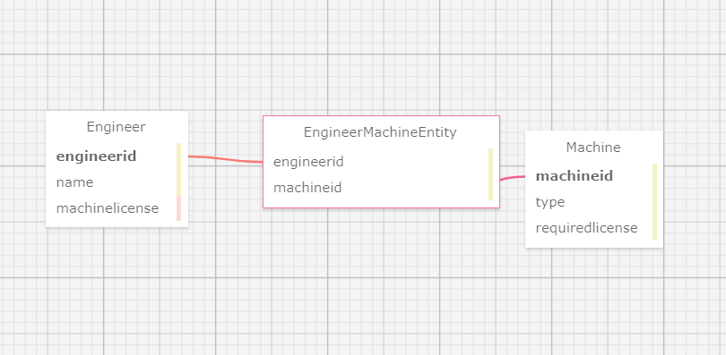

# _Dr. Sillystringz's Factory App_

#### _Application to Keep track of your factory machines and engineers!_

#### By Erik Z./Molag92

## Technologies Used

* _C#_
* _.NET v6.0_
* _MSTest.TestAdapter v2.2.10_
* _MSTest.TestFramework v2.2.10_
* _Git_
* _VSCode_

## Description

_This small application uses MVC setup with a many to many relationship between engineers and factory machines. this app offers Full CRUD and functional migration services_

## Setup/Installation Requirements

* _Clone "Many_To_Many_Code_Review.Solution“ from the repository to your desktop_
* _Navigate to "Many_To_Many_Code_Review.Solution" directory via your local terminal command line_
* _Navigate to the production directory "Many_To_Many_Code_Review"_
* _Navigate to the Many_To_Many_Code_Review folder in your terminal_
* _Then inside the project folder "Factory", build a appsettings.json file, {
    "ConnectionStrings": {
      "DefaultConnection": "Server=localhost;Port=3306;database=[!!PROJECTNAME!!];uid=root;pwd=[!Yourpassword!];"
    }
  } _
* _Please then add appsettings.json to your gitignore file. at this point, throw out a git init, git add .gitignore, and a git commit -m "initial commit"_
* _Then type ***dotnet build*** in your terminal to make sure everything is up to date and there are no errors_
* _Then launch the webpage by typing ***dotnet watch run --launch-profile "production"*** in the teminal_
* _For issuing and trusting a security certificate, type ***dotnet dev-certs https --trust*** in the terminal and restart your browser_
* _If you would like to run the tests, type ***dotnet restore*** in the terminal to restore the dependencies that are listed in the .csproj file_
* _Run the tests by moving into the Many_To_Many_Code_Review.Tests folder and typing ***dotnet test*** in the terminal to run tests_

## Known Bugs

* _No known bugs as of 8/05/23_

## License

MIT License

Copyright (c) [2023] Erik Z.

Permission is hereby granted, free of charge, to any person obtaining a copy
of this software and associated documentation files (the "Software"), to deal
in the Software without restriction, including without limitation the rights
to use, copy, modify, merge, publish, distribute, sublicense, and/or sell
copies of the Software, and to permit persons to whom the Software is
furnished to do so, subject to the following conditions:

The above copyright notice and this permission notice shall be included in all
copies or substantial portions of the Software.

THE SOFTWARE IS PROVIDED "AS IS", WITHOUT WARRANTY OF ANY KIND, EXPRESS OR
IMPLIED, INCLUDING BUT NOT LIMITED TO THE WARRANTIES OF MERCHANTABILITY,
FITNESS FOR A PARTICULAR PURPOSE AND NONINFRINGEMENT. IN NO EVENT SHALL THE
AUTHORS OR COPYRIGHT HOLDERS BE LIABLE FOR ANY CLAIM, DAMAGES OR OTHER
LIABILITY, WHETHER IN AN ACTION OF CONTRACT, TORT OR OTHERWISE, ARISING FROM,
OUT OF OR IN CONNECTION WITH THE SOFTWARE OR THE USE OR OTHER DEALINGS IN THE
SOFTWARE.

_If you run into any issues or have questions, ideas or concerns, please reach out to me via email: Molagg92@gmail.com.  Contributions to the code are highly encouraged._